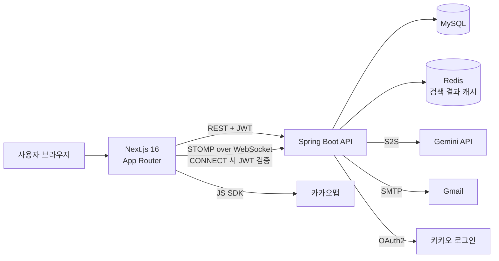

# Campus Market

> 대학교 이메일로 인증된 학생끼리만 거래하는 **교내 중고거래 서비스**
>
> 상품 등록·검색부터 카카오맵 거래 장소 지정, 실시간 채팅, 거래 완료까지 직접 설계하고 구현한 1인 풀스택 프로젝트입니다.
> 기능 구현 이후에는 **동시성·보안·실기동 점검**을 통해 실제 서비스에서 터질 수 있는 문제를 찾아 재현하고, 테스트로 검증하며 고쳤습니다.

<p>
  
  
  
  
  
  
  
</p>

| 항목 | 내용 |
| --- | --- |
| 기간 | 2026.04 – 2026.05 (이후 리팩토링·보안 점검 진행) |
| 인원 | 1인 (백엔드 · 프론트엔드 전체) |
| 백엔드 | Java 21, Spring Boot 4, Spring Data JPA, QueryDSL, Spring Security, JWT, OAuth2(카카오), WebSocket(STOMP), Redis, MySQL |
| 프론트엔드 | Next.js 16 (App Router), React 19, TypeScript, Tailwind CSS, Axios, STOMP.js |
| 외부 연동 | 카카오 로그인·카카오맵, Google Gemini API, Gmail SMTP |
| 테스트 | JUnit 5 (10개 클래스 · 30개 케이스), Vitest, k6 |

<br>

## 목차

1. [주요 기능](#주요-기능)
2. [아키텍처](#아키텍처)
3. [핵심 문제 해결](#핵심-문제-해결)
4. [그 밖의 트러블슈팅](#그-밖의-트러블슈팅)
5. [테스트](#테스트)
6. [실행 방법](#실행-방법)
7. [프로젝트 구조](#프로젝트-구조)
8. [알려진 한계와 다음 과제](#알려진-한계와-다음-과제)

<br>

## 주요 기능

| 기능 | 설명 |
| --- | --- |
| **대학 이메일 인증** | 학교 도메인 이메일로 인증 코드를 발송하고 5분 유효시간(TTL)을 적용해 재학생만 가입 |
| **카카오 로그인** | 백엔드가 카카오와 직접 통신해 JWT를 발급 — 프론트엔드에 카카오 토큰이 노출되지 않음 |
| **상품 등록·수정·검색** | 이미지 다중 업로드, 키워드·카테고리·판매 상태 필터, 페이지네이션 |
| **거래 희망 장소** | 판매자가 카카오맵에서 장소를 찍으면 주소가 자동 입력되고, 구매자는 상세 페이지 지도에서 확인 |
| **실시간 1:1 채팅** | WebSocket(STOMP) 기반, 연결 시 JWT로 사용자 인증 |
| **찜하기 · 거래 완료** | 동시 요청에서도 정확하게 반영되도록 락 전략 적용 ([아래 1번](#1-동시-요청에서-거래좋아요-데이터가-틀어지는-문제)) |
| **AI 판매글 도우미** | Gemini API로 판매글 자동 작성과 부적절한 게시글 필터링 — API 키 보호를 위해 서버에서만 호출 |
| **리뷰 · 신뢰 점수** | 거래 완료 후 구매자가 판매자 평가, 평균 평점은 DB 집계 쿼리로 계산 |

<br>

## 아키텍처



- **인증**: HTTP 요청은 `JwtAuthenticationFilter`, WebSocket은 `StompAuthChannelInterceptor`가 각각 JWT를 검증합니다.
- **외부 API 호출은 모두 서버에서**: Gemini·SMTP·카카오 OAuth는 서버 간 통신으로 처리해 API 키가 브라우저로 나가지 않습니다.
- **예외 처리 일원화**: `GlobalExceptionHandler`가 락 충돌은 409, 입력값 검증 실패는 400으로 통일해 반환합니다.

<br>

## 핵심 문제 해결

### 1. 동시 요청에서 거래·좋아요 데이터가 틀어지는 문제

**문제**

코드 리뷰 중 `completeTrade`(거래 완료)가 락이나 상태 확인 없이 구매자 정보를 그대로 덮어쓰는 것을 발견했습니다. 두 구매자가 동시에 거래 완료를 누르면 실제 거래 상대가 조용히 다른 사람으로 바뀔 수 있는, 쇼핑몰의 재고 이중 판매와 같은 수준의 정합성 문제였습니다.

**재현**

`ExecutorService` + `CountDownLatch`로 동시 요청 테스트를 작성해 실제로 재현했습니다.

- 거래 완료: 두 요청이 **모두 성공**하고, 나중에 커밋된 구매자로 덮어써짐
- 좋아요: 동시 요청 **20건 중 1건만 반영**

**해결 — 기능의 성격에 따라 락을 다르게 선택**

| | 거래 완료 | 좋아요 |
| --- | --- | --- |
| 특징 | 호출 빈도 낮음, 재시도를 요구하기 어려움 | 호출 빈도 높음, 실패 비용 낮음 |
| 전략 | **비관적 락** (`SELECT ... FOR UPDATE`) + 이미 판매완료면 재처리 거부하는 상태 가드 | **낙관적 락** (`@Version`) + 짧은 재시도 |
| 결과 | 정확히 1명만 성공, 나머지는 409 | 20건 모두 정확히 반영 |

- 처음에는 낙관적 락 실패(`ObjectOptimisticLockingFailureException`)만 재시도했지만, 요청이 몰리면 버전 충돌보다 **InnoDB 데드락이 먼저 발생**하는 것을 측정 중에 발견했습니다. 재시도 대상을 두 예외의 공통 상위 타입인 `ConcurrencyFailureException`으로 넓혀 해결했습니다.
- 같은 조건(동시 20건)에서 두 방식의 처리 시간을 비교했습니다: 낙관적 락 + 재시도 **301ms**, 비관적 락 **60ms**. 경합이 심한 상황에서는 재시도 비용이 커진다는 점을 확인했고, 좋아요는 일반적으로 경합이 낮다는 판단 아래 낙관적 락을 유지했습니다.
- 재현·검증 과정은 `ProductConcurrencyTest`로 남겨 언제든 다시 확인할 수 있습니다.

<br>

### 2. 같은 채팅방이 여러 개 생기는 레이스 컨디션

**문제**

`createOrGetRoom`이 "조회해서 없으면 생성"하는 구조라, 같은 상품·구매자 조합으로 요청이 동시에 들어오면 채팅방이 여러 개 생길 수 있었습니다.

**해결**

1. `(product_id, buyer_id)` 유니크 제약으로 DB 차원에서 중복을 차단
2. 경쟁에서 진 요청은 `DataIntegrityViolationException`을 잡아 다시 조회하도록 재시도

**구현 중 테스트가 잡아낸 함정 두 가지**

- **트랜잭션 스냅샷 문제**: 처음에는 바깥 트랜잭션에서 다시 조회했는데, MySQL 기본 격리 수준(REPEATABLE READ)에서는 트랜잭션 시작 시점의 스냅샷을 보기 때문에 **다른 트랜잭션이 방금 만든 방이 보이지 않았습니다**(동시 요청 10건 중 9건 실패). 조회와 생성을 `REQUIRES_NEW` 트랜잭션으로 분리하고 재시도할 때마다 새 트랜잭션을 시작하도록 바꿨습니다.
- **지연 로딩 예외**: 분리한 트랜잭션이 끝나면서 세션이 닫혀, 이미 있던 방을 조회한 경우에만 `LazyInitializationException`이 발생했습니다. `JOIN FETCH`로 연관 엔티티를 미리 함께 불러와 해결했습니다.

**결과**: 동시 요청 10건을 보내도 채팅방이 정확히 1개만 생성되는 것을 테스트와 실제 서버 호출(curl 10건 동시 전송) 양쪽에서 확인했습니다.

<br>

### 3. 보안 취약점 점검과 수정

기능이 "동작한다"에서 멈추지 않고, 실제 공격 시나리오 기준으로 코드를 다시 점검했습니다.

| 취약점 | 문제 | 해결 |
| --- | --- | --- |
| **채팅 메시지 위조** | WebSocket 경로는 HTTP 인증 필터를 거치지 않아 인증이 없었고, 클라이언트가 보낸 `senderId`를 그대로 믿어 **다른 사람 명의로 메시지 전송 가능** | STOMP CONNECT 시 JWT를 검증하는 인터셉터 추가, 발신자는 인증 정보에서만 꺼내도록 변경 |
| **타인 채팅 열람(IDOR)** | 로그인만 하면 채팅방 번호를 바꿔가며 **남의 대화를 조회 가능** | 채팅방 참여자(판매자·구매자)인지 검증 후에만 조회 허용 |
| **비밀번호 평문 저장** | 비밀번호를 암호화 없이 저장·비교 | BCrypt 해시로 저장하고 `matches()`로 비교 |
| **파일 경로 조작** | 업로드 파일의 원본 이름을 저장 경로에 그대로 사용 | 서버가 생성한 이름으로 저장, 이미지 확장자 화이트리스트 검증 |
| **학번 노출** | 다른 사용자 프로필 조회 시 학번까지 응답 | 공개용 응답 DTO를 분리해 본인 조회에서만 학번 포함 |
| **입력값 검증 부재** | 요청 DTO에 검증이 전혀 없음 | Bean Validation 전면 적용, 실패 시 400으로 통일 |
| **API 키 커밋** | 설정 파일에 외부 API 키가 커밋된 이력 | git 히스토리에서 완전히 제거하고 키 재발급, 환경 변수(`.env`)로 분리 |

각 항목마다 정상·실패 케이스를 검증하는 테스트를 함께 추가했습니다(예: 위조 토큰으로 STOMP 연결 시 거부되는지, 비참여자가 메시지를 보내면 거부되는지).

<br>

### 4. 단위 테스트가 놓친 버그를 실기동 점검으로 발견

회원가입(실제 인증 메일 발송)부터 상품 등록·검색·찜·채팅·거래 완료까지 전 과정을 브라우저로 직접 돌려보며, 테스트는 통과했지만 실제로는 깨져 있던 버그를 찾았습니다.

- **채팅 전송이 전부 실패하던 문제**: STOMP 인증 인터셉터에서 경고를 없애려고 바꾼 API가, Spring이 연결 시점에 인증 정보를 세션에 등록하는 내부 콜백과의 연결을 끊고 있었습니다. 단위 테스트는 이 콜백까지 확인하지 않아 통과했지만 실제로는 모든 메시지가 NPE로 실패했습니다. 올바른 API로 되돌리고, **콜백이 실제로 호출되는지까지 확인하는 테스트**를 추가했습니다.
- **지도에서 찍은 위치가 엉뚱한 곳으로 저장되던 문제**: 지도가 처음 열릴 때 브라우저 위치(GPS)를 받아 이동하는데, 사용자가 먼저 지도를 클릭해도 늦게 도착한 GPS 응답이 클릭한 위치를 덮어썼습니다(서울을 찍었는데 강원도로 저장). 사용자가 이미 선택했으면 GPS 응답을 무시하도록 수정했습니다.
- **프로덕션 빌드 실패**: 개발 서버에서는 정상이었지만 `npm run build`가 실패하던 페이지 2개를 발견해 수정했습니다.

<br>

## 그 밖의 트러블슈팅

<details>
<summary><b>펼쳐 보기</b></summary>

<br>

**백엔드**

- **N+1 쿼리**: 채팅방 목록이 방 개수만큼 쿼리를 반복 실행 → 배치 쿼리 1회로 축소. 상품 검색은 판매자 정보를 fetch join으로 함께 조회하고, 이미지 목록은 페이징과 충돌하지 않도록 `default_batch_fetch_size`로 일괄 조회
- **상품 삭제 실패**: 찜·채팅방·리뷰가 연결된 상품은 외래 키 제약으로 삭제가 실패 → 연관 데이터를 순서대로 먼저 정리하도록 수정
- **메인 화면 노출 오류**: 상태 필터가 없으면 판매완료 상품까지 노출 → 기본값을 "판매중·예약중"으로 지정
- **리뷰 중복 작성**: 중복 확인 메서드가 정의만 되고 호출되지 않던 것을 발견해 가드 추가
- **조회 인덱스**: 목록·검색이 주로 쓰는 `(status, created_at)`, `category` 인덱스 추가
- **`isLiked` 직렬화**: Jackson이 boolean 필드의 `is` 접두사를 제거해 `liked`로 내려가던 문제 → `@JsonProperty("isLiked")`
- **세션 → JWT 전환**: 프론트·백엔드 포트가 분리된 환경에서 세션 쿠키 공유 문제 → Stateless JWT 인증으로 전환

**프론트엔드**

- **한글 입력 중복 전송**: 한글 조합 중 Enter를 누르면 메시지가 두 번 전송 → `isComposing` 상태일 때 이벤트 무시
- **멀티파트 업로드 실패**: `Content-Type`을 직접 지정하면 boundary가 빠져 서버 파싱 실패 → 브라우저가 자동 생성하도록 수정
- **새로고침 시 로그인 화면으로 이동**: 인증 상태 복원(hydration) 전에 리다이렉트가 실행 → 복원 완료 후에만 판단하도록 수정
- **배포 환경 호환성**: `localhost`가 하드코딩된 API 호출을 공용 Axios 클라이언트로 교체해 환경 변수를 따르도록 정리
- **중복 로직 통합**: 페이지 3곳에서 각자 구현하던 JWT 사용자 ID 해석을 `useCurrentUserId` 훅 하나로 통합

</details>

<br>

## 테스트

| 구분 | 내용 |
| --- | --- |
| 동시성 | `ProductConcurrencyTest` — 거래 완료·좋아요 동시 요청 재현, 낙관적/비관적 락 처리 시간 비교 |
| 레이스 컨디션 | `ChatServiceTest` — 동시 10건 요청 시 채팅방 1개만 생성, 비참여자 조회·전송 거부 |
| 보안 | `StompAuthChannelInterceptorTest` — 정상·누락·위조 토큰, 인증 결과의 세션 등록 여부 / `FileUploadUtilTest` — 확장자 화이트리스트, 경로 조작 방지 |
| 인증·회원 | `UserServiceTest`(비밀번호 해시), `EmailServiceTest`(인증 코드 만료) |
| 입력 검증 | `UserControllerValidationTest`, `ProductControllerValidationTest`(멀티파트 요청 포함) |
| 상품·리뷰 | `ProductServiceTest`(연관 데이터 정리 후 삭제, 거래 희망 장소 저장·수정, 상태 필터), `ReviewServiceTest`(중복 작성 방지, 신뢰 점수 평균 갱신) |
| 프론트엔드 | Vitest — `useCurrentUserId`(JWT 해석), `productApi`(API 클라이언트 호출) |

```bash
# 백엔드 (로컬 MySQL·Redis 필요)
cd backend && ./gradlew test

# 프론트엔드
cd frontend && npm run test
```

<br>

## 실행 방법

**필요 환경**: Java 21, Node.js 20+, MySQL 8, Redis

**1. 환경 변수** — 저장소 루트에 `.env` 생성 (Gradle이 읽어 백엔드 실행·테스트에 주입합니다)

```env
GOOGLE_APP_PASSWORD=your-gmail-app-password
GEMINI_API_KEY=your-gemini-api-key
```

`frontend/.env.local`

```env
NEXT_PUBLIC_API_URL=http://localhost:8080
NEXT_PUBLIC_WS_ENDPOINT=http://localhost:8080/ws-stomp
NEXT_PUBLIC_KAKAO_MAP_KEY=your-kakao-javascript-key
```

**2. 백엔드 설정** — `backend/src/main/resources/application.yml`을 만들고 DB, 메일, JWT, 카카오 OAuth, 파일 업로드 경로를 설정합니다.

```yaml
spring:
  datasource:
    url: jdbc:mysql://localhost:3306/campus_market
    username: YOUR_DB_USER
    password: YOUR_DB_PASSWORD
  data:
    redis:
      host: localhost
      port: 6379
  security:
    oauth2:
      client:
        registration:
          kakao:
            client-id: YOUR_KAKAO_CLIENT_ID
            client-secret: YOUR_KAKAO_CLIENT_SECRET
            client-authentication-method: client_secret_post
            authorization-grant-type: authorization_code
            redirect-uri: "{baseUrl}/login/oauth2/code/kakao"
            scope:
              - profile_nickname
              - account_email
            client-name: Kakao
        provider:
          kakao:
            authorization-uri: https://kauth.kakao.com/oauth/authorize
            token-uri: https://kauth.kakao.com/oauth/token
            user-info-uri: https://kapi.kakao.com/v2/user/me
            user-name-attribute: id
  mail:
    host: smtp.gmail.com
    port: 587
    username: YOUR_GMAIL
    password: ${GOOGLE_APP_PASSWORD}

jwt:
  secret: YOUR_JWT_SECRET
gemini:
  api:
    key: ${GEMINI_API_KEY}
file:
  upload-dir: /path/to/uploads/
```

**3. 실행**

```bash
# 백엔드 (http://localhost:8080)
cd backend && ./gradlew bootRun

# 프론트엔드 (http://localhost:3000)
cd frontend && npm install && npm run dev
```

<br>

## 프로젝트 구조

```
campus-market-app/
├── backend/                     Spring Boot API 서버
│   └── src/main/java/com/compus/campusmarket/
│       ├── domain/
│       │   ├── user/            회원가입·로그인·이메일 인증·프로필
│       │   ├── product/         상품·이미지·찜·검색(QueryDSL)·캐시
│       │   │   └── review/      거래 후기·신뢰 점수
│       │   ├── chat/            채팅방·메시지(STOMP)
│       │   └── ai/              Gemini 연동
│       └── global/
│           ├── config/          Security·JWT·WebSocket·Redis·OAuth2
│           ├── exception/       전역 예외 처리
│           └── util/            JWT 발급, 파일 업로드
├── frontend/                    Next.js 앱
│   ├── app/                     페이지(홈, 상품, 업로드, 채팅, 마이페이지, 로그인)
│   └── src/                     컴포넌트, API 클라이언트, 훅, 카카오맵 로더
└── docs/                        리팩토링 작업 기록
```

<br>

## 알려진 한계와 다음 과제

완성된 척하기보다 지금 상태를 정확히 남겨둡니다.

- **리뷰 작성 화면 미구현**: 리뷰 API와 중복 방지는 완성되어 있지만, 프론트엔드 작성 폼은 아직 없습니다.
- **실행 환경 분리**: 설정이 로컬 개발 기준이라, 배포하려면 `local`/`prod` 프로필 분리가 먼저 필요합니다.
- **Redis 캐시 무효화**: 검색 첫 페이지를 캐싱하지만 상품 변경 시 캐시를 비우는 로직이 없어, 변경 사항이 바로 반영되지 않을 수 있습니다.
- **이메일 인증 코드 저장소**: 현재 서버 메모리에 저장해 단일 서버에서만 정상 동작합니다. 여러 서버로 늘릴 경우 Redis로 옮겨야 합니다.
- **테스트 공백**: 카카오 로그인 전체 흐름, Gemini 연동 실패 시 동작 등은 아직 테스트가 없습니다.

<br>

## 개발 방식

기능 개발 이후의 코드 점검과 리팩토링에는 AI 코딩 도구(Claude Code)를 리뷰어로 활용했습니다. AI가 찾은 후보 이슈는 직접 재현 테스트로 실제 문제인지 확인한 뒤 수정했고, 모든 변경은 백엔드·프론트엔드 전체 테스트와 브라우저 실기동으로 검증했습니다. 자세한 과정은 [`docs/REFACTOR_LOG.md`](docs/REFACTOR_LOG.md)에 남겨두었습니다.
